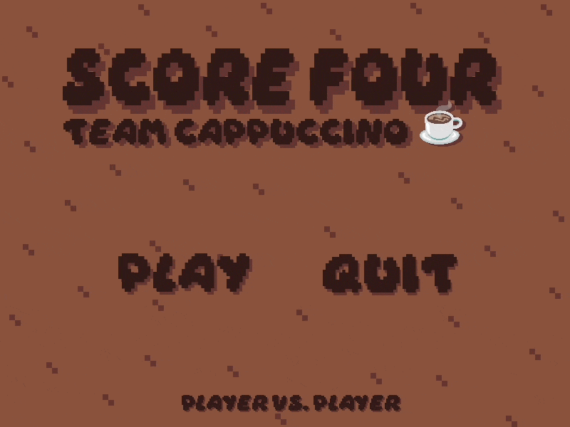
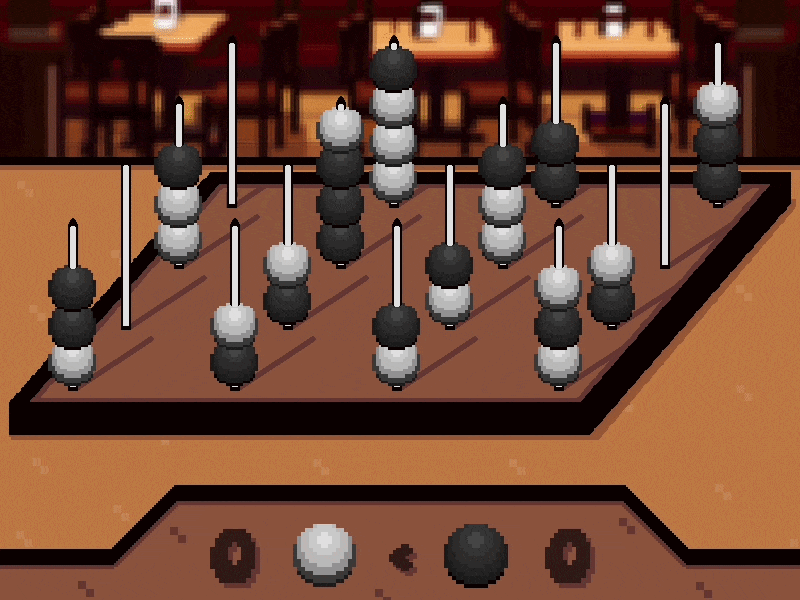

# Cappuccino Score Four ☕✨

> *A classic strategy game, brewed to perfection.*

Score Four is a 3D connect-four strategy game where two players compete to align four beads on a 4×4×4 peg board. This Java implementation of the game built by Team Cappuccino includes a polished GUI, a computer opponent, and lots more.

## Screenshots

### Main Menu

### Gameplay

##  Modes

- **Player vs computer** — face off against a computer opponent
- **Player vs player** — play locally against a friend
- **Computer vs computer** - watch two computer players battle it out

## How to Play

1. Launch the game via the provided `.jar` file found in the releases
2. Select a game mode from the main menu
3. Take turns dropping beads onto the pegs
4. First player to align **four beads in a row** (horizontally, vertically, or diagonally) wins!

## Team Cappuccino

| Name |
|---|
| Charlie Dunsford |
| Daniya Siddiqui |
| Luke Smyth |
| Lucas Wilson |
| Clara Wyatt |

  Built with Java · Powered by caffeine ☕

